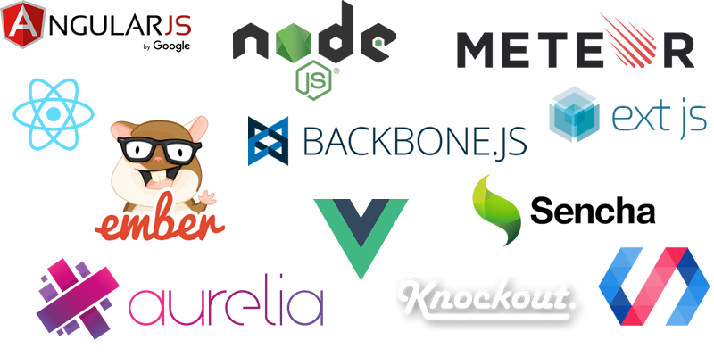

## Learning cutting edge technologies

We're here to learn...

---

## Learning cutting edge technologies

We're here to learn...

Note:
As developers we always want to work with the hot stuff, bleeding edge technologies. These are great! (some more than others) They let you think everything is possible inside that framework... well almost everything, but this doesn't make sense if we refuse to learn some fundamentals.

---

## Why we're actually here

We're here to learn...

Like it or not, the most widely used web language and library [1](http://pypl.github.io/PYPL.html).

---

## Intended audience

- Backend developers that want an introduction to frontend.
- Frontend developers that want to learn more about this technologies.
- Developers that think we should ditch JS and jQuery, and solely go for [Insert cool transpiled language] and [Insert cool framework].

---

## A bit of history

For those who can't remember, 10+ years ago frontend development was a mess

---

## A bit of history

### W3C DOM standard poorly implemented.
- Like SQL, different vendors had different approaches to the same thing (eg. addEventListener / attachEvent).
- Much of the frustration and anger against JS comes from interacting with the DOM.

---

## A bit of history

### ECMAScript 3
- ECMAScript 5 would be released on 2009
- Javascript has always been a poorly understood language with some well intentioned features (that were terrible design choices)
- And other source of frustration comes from the lack of understanding of the language, we normally use it on the (this is a two edged sword)

---

## A bit of history

Then Circa 2006

jQuery Came

---

## A bit of history

Then Circa 2009

Javascript 5 Came

Note:
These two technologies set the foundations of what we know now about frontend
development, and want to emphasize there is value in learning both

---

## jQuery... wot?

So, what's jQuery?
- An attempt to unify and simplify interaction with the DOM.
- Provide nice polyfills[1](http://stackoverflow.com/questions/6599815/what-is-the-difference-between-a-shim-and-a-polyfill) to the language
- Library, not a framework.
    - This means that will give lots of freedom and flexibility, including how to shoot your own foot.
    - Rich plugin ecosystem (2700+ "official")
- So widely adopted that many used to think writing jQuery was writing JS.

Note:
A lightweight drop-in replacement could be used: http://zeptojs.com/

Being a library give us lots of freedom, we can do anything we want to the DOM, but we also lack structure (like a MVC framework) and it's easy to overuse and end up with spaghetti code.

---

## jQuery... wot?

We can roughly divide jQuery into the modules
- DOM: Query, traverse & manipulate
- Events
- Ajax
- Not worth mentioning (effects, css, deprecated)

And we also have **Plugins**

---

## DOM - Document Object Model

The Document Object Model (DOM) is a cross-platform and language-independent API
that treats HTML as a tree structure, wherein each node is an object representing
a part of the document.

Or a more simply, the DOM is the memory representation of the HTML downloaded and parsed.
This object has methods and properties that can be interacted with.

This is accessible through the document property.

---

## Dynamic HTML

In frontend web development interacting with the DOM becomes paramount for activities such as:
- React to user input events (ie. Mouse Clicks, Keyboard typing, and more).
- Provide visual feedback (ie. Animations, change look & feel, and more).
- Modify the information displayed (through AJAX).

JQuery provides an API for doing all this and more...

---

## Dynamic HTML elements

In the tree-like structure the elements have four important properties:
- **Tag name** (e.g. img, input, form, div, span)
- **Attributes** (e.g. title, src, href)
- **Classes** (okay, I cheated here, class is a very special attribute)
- **Event listeners** (e.g. onclick, onload, onchange.)

These are going to be very useful when selecting or querying elements we want to interact with.
