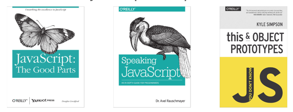

## Property descriptors

Property descriptors let us define ad-hoc properties to our objects

```js
var john = Object.create({}, {
  name: { // normal property
    enumerable: true,
    writable: true,
    value: 'John McCarthy'
  },
  firstName: { // computed property
    get: function () { return this.name.split(' ')[0]; },
    set: function (val) { ... }
  }
});
```

---

## Property descriptors - Anatomy

```js
var nameDescriptor = {
  configurable: true, // Can the configuration/descriptor change over time?
  enumerable: true, // Will it appear in for-in loops?
  writable: true, // Is it writable or read only?
  value: 'John McCarthy'
}

// If getter or setter is defined, JS will ignore the `value` attribute.
var firstNameDescriptor = {
  get: function () { return this.name.split(' ')[0]; },
  set: function (val) { this.name = val + this.name.split(' ')[1]; }
});
```

---

## Things that didn't cover… but wanted to

- Object immutability (_preventExtensions_, _seal_, _freeze_)
- Closures in depth
- More idioms (Modules, IIFE, options on jQuery)
- HTML traversing (_filter_, _find_, _children_)
- Bad parts (with, type coercion and others)

---

## Where to go from here

- Javascript: The Good Parts -- _Crockford_
- Speaking Javascript -- _Rauschmayer_
- You don't know Javascript -- _Simpson_


